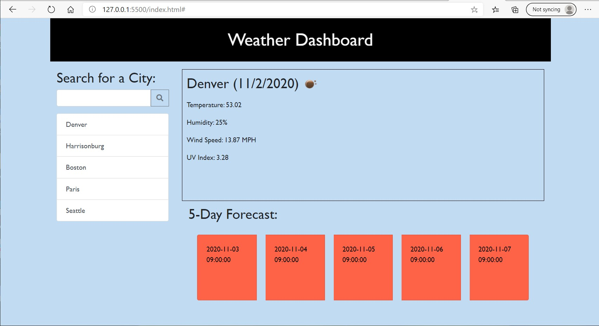

Third party APIs allow developers to fetch information from their servers and apply them to their own applications. One method of retrieving a third party API can be through weather applications. A weather dashboard can provide a traveler with predicted weather outlooks to plan their trip accordingly. The functions built within this application work as such:

- Fetching information from the Open Weather API to provide real time weather forecast
- Using a form input, a user can enter a location and receive the weather for that location
- Given a UV index one can view if weather conditions are favorable, moderate or severe
- A 5-day forecast can display future weather conditions with temperature and humidity

The image and link provided below will demonstrate the functions of the daily planner:

[Weather Dashboard](https://jkeopangna.github.io/weatherDashboard/ "Weather Dashboard")
